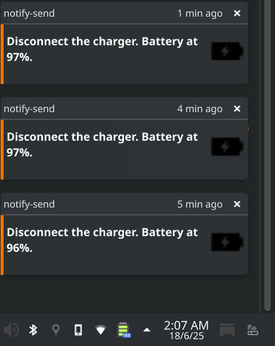
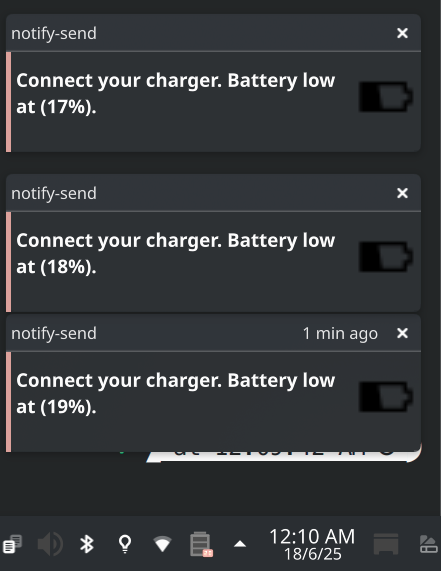
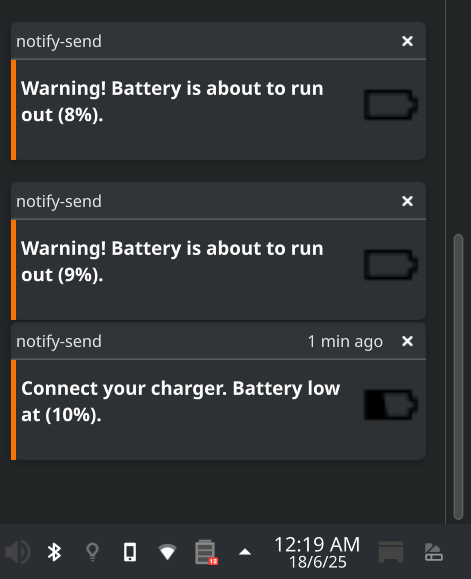

# Battery-Percentage-Alarm's Installation Guide
## Table of Contents

  - [Introduction](#introduction)
    - [Screenshots](#screenshots)
    - [Manual Adjustment](#manual-adjustment)
  - [Prerequisites](#prerequisites)
    - [Install notify-send](#install-notify-send)
      - [Debian/Ubuntu](#debian/ubuntu)
      - [Fedora](#fedora)
      - [Arch](#arch)
      - [Cloning the repository](#cloning-the-repository)
  - [Autostart Configuration](#autostart-configuration)
      - [Grant execution permissions to the file](#grant-execution-permissions-to-the-file)
    - [Method 1 .desktop File](#method-1-.desktop-file)
      - [Verify the existence of the autostart directory](#verify-the-existence-of-the-autostart-directory)
      - [Create the battery_alarm.desktop file](#create-the-battery_alarm.desktop-file)
      - [Content of the .desktop file](#content-of-the-.desktop-file)
    - [Method 2 systemd Service](#method-2-systemd-service)
      - [Move the script file to the /usr/local/bin directory](#move-the-script-file-to-the-/usr/local/bin-directory)
      - [Grant execution permissions to the script](#grant-execution-permissions-to-the-script)
      - [Create and edit the .service file for systemd](#create-and-edit-the-.service-file-for-systemd)
      - [Content of the .service file](#content-of-the-.service-file)
      - [Reload the systemd configuration](#reload-the-systemd-configuration)
      - [Enable and start the service](#enable-and-start-the-service)
      - [Verify the status of the service](#verify-the-status-of-the-service)
  - [Remove Script Autostart](#remove-script-autostart)
    - [Method 1 Removing the .desktop File](#method-1-removing-the-.desktop-file)
    - [Method 2 Removing the systemd Service](#method-2-removing-the-systemd-service)
      - [Stop the service](#stop-the-service)
      - [Disable the service to prevent it from starting on boot](#disable-the-service-to-prevent-it-from-starting-on-boot)
      - [Remove the service unit file](#remove-the-service-unit-file)
      - [Reload the systemd daemon to apply changes](#reload-the-systemd-daemon-to-apply-changes)


---
## Introduction
Hello everyone! Battery Percentage Alarm is a bash script designed to remind you to connect or disconnect your laptop's power cable when the battery reaches a specific charge percentage.

### Screenshots
Some screenshots of the script running
|  |  |  |
|-------------------------------------------|-------------------------------------------|-------------------------------------------|

### Manual Adjustment
You can manually adjust the battery charge percentage thresholds in the .sh file. The default values are:

    BATTERY_LOW_THRESHOLD=20
    BATTERY_CRITICAL_THRESHOLD=10
    BATTERY_HIGH_THRESHOLD=95

Additionally, you can modify the notification duration and the interval between each notification

    DURATION=10000 (in milliseconds)
    MIN_INTERVAL=60 (in seconds)

## Prerequisites
### Install notify-send
****notify-send**** utilizes the libnotify library, which is used in Linux to display desktop notifications on Unix-based operating systems. These notifications typically appear as small pop-up windows at the top or bottom of the screen and can contain text, icons, action buttons, and other elements to interact with the user.

****notify-send**** will help us send alert notifications to the desktop when the battery reaches the configured percentage thresholds in the script.

To install ****notify-send****, run the following command according to your distribution

#### Debian/Ubuntu
```bash 
sudo apt-get install libnotify-bin
```

#### Fedora
```bash 
sudo dnf install libnotify
```

#### Arch
```bash 
sudo pacman -S libnotify
```
#### Cloning the repository
To obtain the script, clone the repository to your local machine

## Autostart Configuration
To configure the script to start upon login, there are two methods creating a .desktop file and adding it to ~/.config/autostart, or using systemd.

#### Grant execution permissions to the file
Execution permissions must be granted for the script to run.
```bash 
sudo chmod +x /full/path/to/script.sh
```
### Method 1 .desktop File

#### Verify the existence of the autostart directory
```bash 
sudo mkdir -p ~/.config/autostart/
```

#### Create the battery_alarm.desktop file
Feel free to rename the .desktop file as you prefer.
```bash 
sudo nano ~/.config/autostart/battery_alarm.desktop
```

#### Content of the .desktop file
Copy and paste the following content into the .desktop file and save it
```bash 
[Desktop Entry]
Type=Application
Exec=/full/path/to/script.sh
Hidden=false
NoDisplay=false
X-GNOME-Autostart-enabled=true
Name=Battery Alarm
Comment=Notifies when the battery is low or high

```
***Type=Application*** Indicates that this is an executable application..

***Exec=*** Specifies the full path to the script you want to execute.

***Hidden=false*** Ensures that the entry is not hidden.

***NoDisplay=false*** Allows the application to appear in graphical interfaces for managing startup applications.

***X-GNOME-Autostart-enabled=true*** Enables autostart in GNOME; other desktop environments also recognize this key.

***Name=Battery Alarm*** Descriptive name of the application.

***Comment=Notifies when the battery is low or high*** Brief description of the script's function.

### Method 2 systemd Service

#### Move the script file to the /usr/local/bin directory
```bash 
sudo cp /current/path/to/script.sh /usr/local/bin/script.sh
```
#### Grant execution permissions to the script
```bash 
sudo chmod +x /usr/local/bin/script.sh
```

#### Create and edit the .service file for systemd
Feel free to change the name of the .service file.
```bash 
sudo nano /etc/systemd/system/battery_alarm.service
```
#### Content of the .service file
Copy and paste the following content into the .service file and save it
```bash 
[Unit]
Description=Battery Alarm
After=multi-user.target

[Service]
ExecStart=/usr/local/bin/script.sh
Type=simple
Restart=on-failure

[Install]
WantedBy=multi-user.target
```
***After=multi-user.target*** Indicates that the service should start after the system is in multi-user mode.

****ExecStart=**** Specifies the full path to the script you want to execute.

****Type=simple****  Indicates that this is a simple service that does not fork into other processes.

****Restart=on-failure***** Configures the service to restart automatically in case of failure.

****WantedBy=multi-user.target**** ESpecifies that the service should start in multi-user mode.

#### Reload the systemd configuration
```bash
sudo systemctl daemon-reload
```

#### Enable and start the service
To have the service start automatically at system boot and run immediately, use the following command
```bash
sudo systemctl enable --now battery_alarm.service
```

#### Verify the status of the service
```bash
sudo systemctl status battery_alarm.service
```

## Remove Script Autostart
If you wish to remove the script's automatic startup from your operating system, follow the method corresponding to your initial setup

### Method 1 Removing the .desktop File
If you configured autostart using a .desktop file
```bash 
rm ~/.config/autostart/script.desktop
```
### Method 2 Removing the systemd Service
If you set up autostart using a systemd service

#### Stop the service
```bash 
sudo systemctl stop battery_alarm.service
```
#### Disable the service to prevent it from starting on boot
```bash 
sudo systemctl disable battery_alarm.service
```
#### Remove the service unit file
```bash 
sudo rm /etc/systemd/system/battery_alarm.service
```
#### Reload the systemd daemon to apply changes
```bash 
sudo systemctl daemon-reload
```